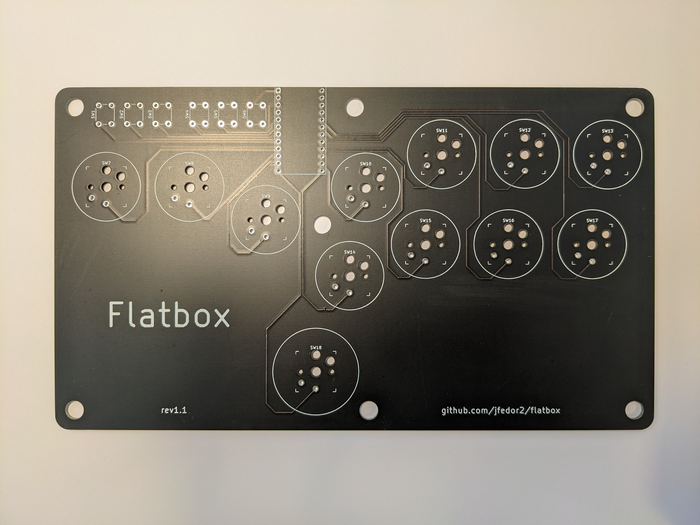
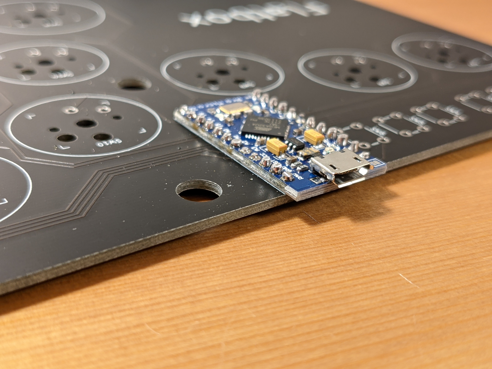
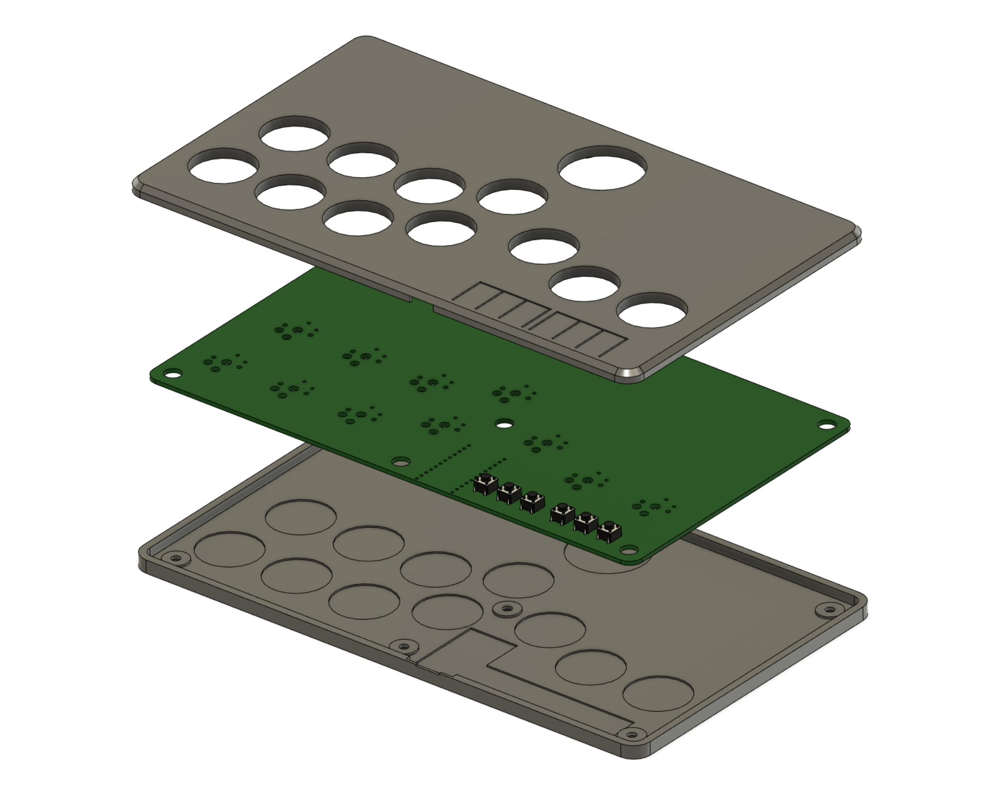

# Flatbox rev1.1

This is rev1.1 of the Flatbox. In this version an Arduino Pro Micro is soldered onto the main PCB.

To make one you will need:

* [3D printed case parts](3d-printed-case) - top and bottom
* [the Flatbox PCB](pcb)
* Arduino Pro Micro
* 12x Kailh low profile (choc v1) switches of your choice
* (optionally) 12x Kailh low profile hotswap sockets
* [3D printed buttoncaps](../3d-printed-buttoncaps)
* 6x 6x6x5mm tact switches
* 7x 3x10mm wood screws
* some kind of rubber feet or non-slip padding for the bottom
* a soldering iron

I printed the case at 0.20mm layer height. The top part should be printed upside-down, the bottom part should be printed as-is. They don't require supports.

The PCB can be ordered from a number of online services using the included [Gerber files](pcb), I used [JLCPCB](https://jlcpcb.com/) (leave all the settings at default, you can choose the PCB color). PCB thickness should be 1.6mm.

The switches can be soldered in directly to the PCB or you can use hotswap sockets. If you want to use hotswap sockets, you will have to print the appropriate bottom part of the case (it's 1mm thicker).

The Arduino has to be soldered directly on top of the PCB, otherwise it won't fit in the case (the plastic base of the pin header can't go between the Arduino and the PCB).

You don't have to use the [code](../firmware) included here, you can use any other ATmega32U4-compatible firmware. The included firmware works with the PS3 and PC.

PCB design licensed under [CC BY-SA 4.0](https://creativecommons.org/licenses/by-sa/4.0/).

PCB design uses the following libraries:

* [keyswitches.pretty](https://github.com/daprice/keyswitches.pretty) by [daprice](https://github.com/daprice) ([CC BY-SA 4.0](https://creativecommons.org/licenses/by-sa/4.0/))
* [ProMicroKiCad](https://github.com/Biacco42/ProMicroKiCad) by [Biacco42](https://github.com/Biacco42), derived from [teensy\_library](https://github.com/XenGi/teensy_library) by Ricardo Band ([MIT License](https://opensource.org/licenses/mit-license.php))
