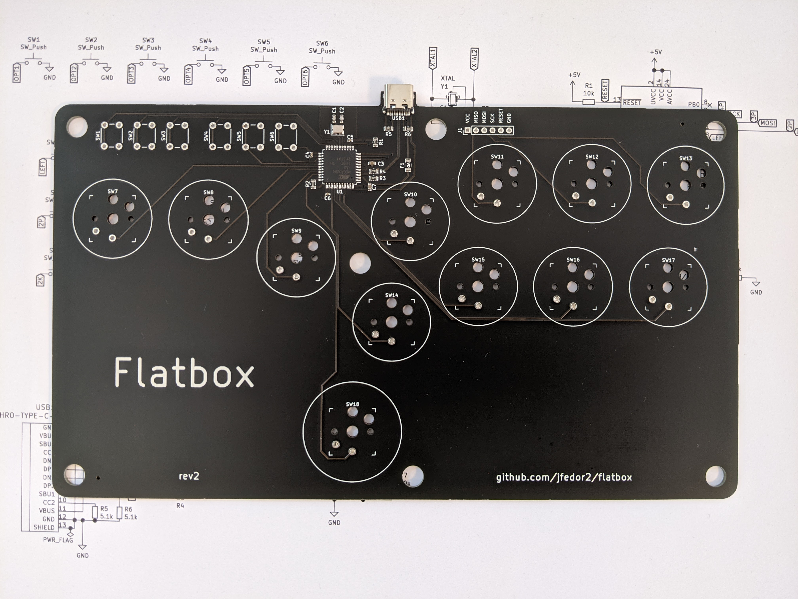
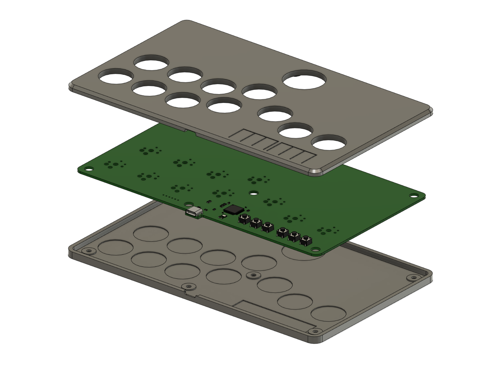

# Flatbox rev2

This is rev2 of the Flatbox. In this version the PCB includes a microcontroller and USB port. Everything is built in, you only have to add the switches (and flash the firmware).

To make one you will need:

* [3D printed case parts](3d-printed-case) - top and bottom
* [the PCB](pcb)
* 12x Kailh low profile (choc v1) switches of your choice
* (optionally) 12x Kailh low profile hotswap sockets
* [3D printed buttoncaps](../3d-printed-buttoncaps)
* 6x 6x6x5mm tact switches
* 7x 3x10mm wood screws
* some kind of rubber feet or non-slip padding for the bottom
* a soldering iron
* an ISP programmer or an Arduino to flash the board with [firmware](../firmware-atmega32u4)

I printed the case at 0.20mm layer height. The top part should be printed upside-down, the bottom part should be printed as-is. They don't require supports.

I used [JLCPCB](https://jlcpcb.com/) to make the PCB and assemble the SMD parts. The [included files](pcb) can be used with JLCPCB directly. If you want to use some other service, check the file formats that they expect. When ordering from JLCPCB, upload the Gerber zip, leave all the settings at default (you can choose the PCB color), then select "SMT Assembly" and upload the BOM and CPL files. PCB thickness should be 1.6mm.

The PCB you get from JLCPCB will look like this:

The switches can be soldered in directly to the PCB or you can use hotswap sockets. If you want to use hotswap sockets, you will have to print the appropriate bottom part of the case (it's 1mm thicker).

You don't have to use the [code](../firmware-atmega32u4) included here, you can use any other ATmega32U4-compatible firmware. The included firmware works with the PS3 and PC.

To flash the firmware, we first flash the board with an Arduino Pro Micro bootloader, effectively making it look like an Arduino from the computer's point of view. To do that you're going to need an ISP programmer, either a dedicated one or you can [use an Arduino as an ISP programmer](https://www.arduino.cc/en/Tutorial/BuiltInExamples/ArduinoISP). Install the [SparkFun Arduino add-on](https://learn.sparkfun.com/tutorials/pro-micro--fio-v3-hookup-guide#windows_boardaddon), connect the VCC, MISO, MOSI, SCK, RESET and GND wires, select Arduino Pro Micro 16MHz/5V as the board, select the right programmer depending on the option you went for, and then select "Burn bootloader". If this succeeds, your Flatbox is now an Arduino Pro Micro and you can flash the actual firmware like you would any other Arduino sketch on an actual Arduino board.

(This is not the only way to flash the firmware. The ATmega32U4 chip comes pre-programmed with a DFU bootloader, so in theory you could use that to flash the Arduino bootloader or just flash the firmware directly. But I think the option described above is easier, even though it requires an ISP programmer, because you just use the Arduino IDE for everything.)

PCB design licensed under [CC BY-SA 4.0](https://creativecommons.org/licenses/by-sa/4.0/).

PCB design uses the following libraries:

* [keyswitches.pretty](https://github.com/daprice/keyswitches.pretty) by [daprice](https://github.com/daprice) ([CC BY-SA 4.0](https://creativecommons.org/licenses/by-sa/4.0/))
* [Type-C.pretty](https://github.com/ai03-2725/Type-C.pretty) by [ai03-2725](https://github.com/ai03-2725)
