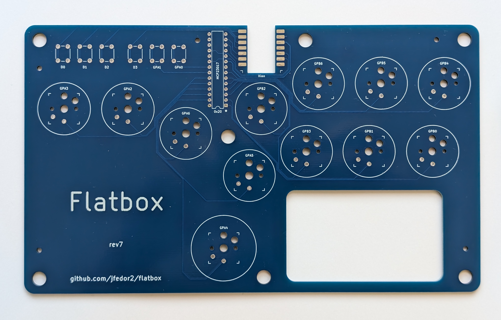
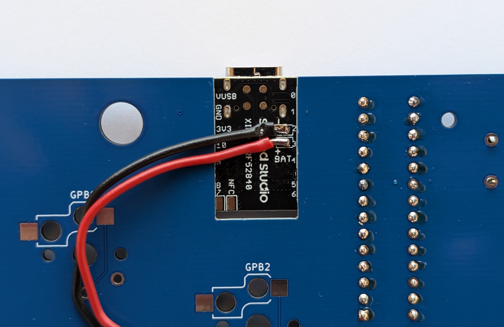
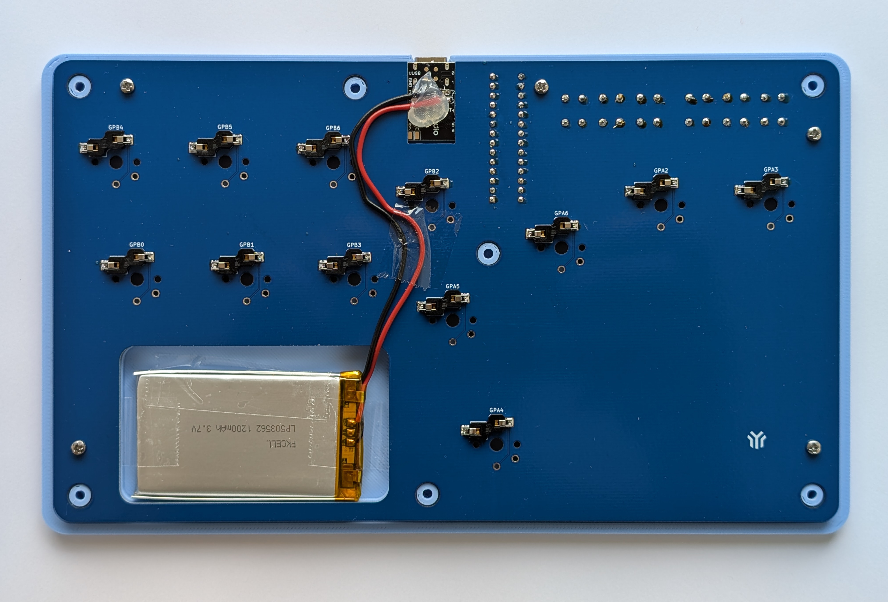
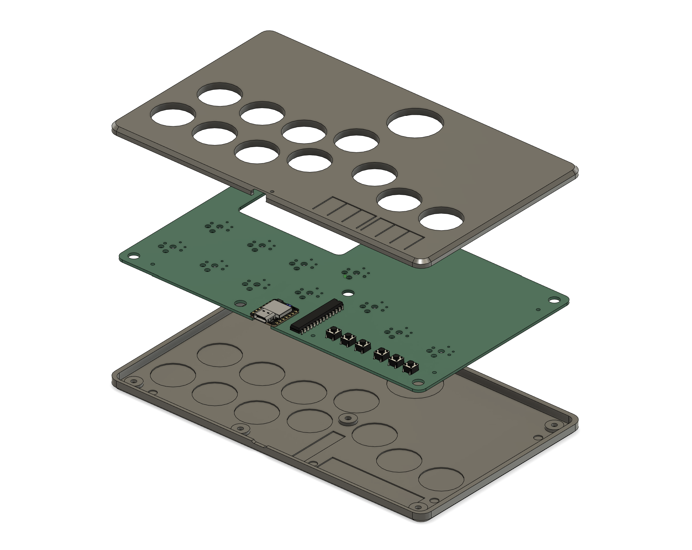

# Flatbox rev7

This is rev7 of the Flatbox. In this version a [Seeed Studio XIAO nRF52840](https://www.seeedstudio.com/Seeed-XIAO-BLE-nRF52840-p-5201.html) board is soldered onto the main PCB.

To make one you will need:

* [3D printed case parts](3d-printed-case) - top and bottom
* [the Flatbox PCB](pcb)
* [Seeed Studio XIAO nRF52840](https://www.seeedstudio.com/Seeed-XIAO-BLE-nRF52840-p-5201.html)
* [MCP23017-E/SP](https://www.microchip.com/en-us/product/mcp23017) I2C I/O expander
* lipo battery - I used [this 1200mAh one from Pimoroni](https://shop.pimoroni.com/products/lipo-battery-pack?variant=20429082183)
* 12x Kailh low profile (choc v1) switches of your choice
* (optionally) 12x Kailh low profile hotswap sockets
* [3D printed buttoncaps](../3d-printed-buttoncaps)
* 6x 6x6x5mm tact switches
* 7x M3x6 flat head (countersunk) screws
* (optionally) 5x M2x4 screws to secure the PCB to the case
* some kind of rubber feet or non-slip padding for the bottom
* a soldering iron

I think this [lipo battery from Adafruit](https://www.adafruit.com/product/258) is the same thing as the Pimoroni one, though I'm not sure about the cable length.

Make sure you get the MCP23017 expander in DIP package. Observe pin 1 orientation when soldering.

I printed the case at 0.20mm layer height. The top part should be printed upside-down, the bottom part should be printed as-is. They don't require supports.

The PCB can be ordered from a number of online services using the included [Gerber files](pcb), I used [JLCPCB](https://jlcpcb.com/) (leave all the settings at default, you can choose the PCB color). PCB thickness should be 1.6mm.

The switches can be soldered in directly to the PCB or you can use hotswap sockets.

You will need to cut off the plug on the battery and solder the wires directly to pads on the bottom of the Xiao board.

To flash the firmware, download the [flatbox-rev7.uf2](https://github.com/jfedor2/slimbox-bt/releases/latest/download/flatbox-rev7.uf2) file from the [slimbox-bt](https://github.com/jfedor2/slimbox-bt) repository. Then connect the board to your computer using a USB cable and press the RESET button on the Xiao board twice quickly (the RESET button is really small, next to the USB port). A USB drive should appear on your computer. Copy the `flatbox-rev7.uf2` file to that drive.

See the [slimbox-bt](https://github.com/jfedor2/slimbox-bt) repository for general usage instructions.

PCB design licensed under [CC BY-SA 4.0](https://creativecommons.org/licenses/by-sa/4.0/).

PCB/case design uses the following:

* [keyswitches.pretty](https://github.com/daprice/keyswitches.pretty) by [daprice](https://github.com/daprice) ([CC BY-SA 4.0](https://creativecommons.org/licenses/by-sa/4.0/))
* Xiao STEP file downloaded from [GrabCAD](https://grabcad.com/library/seeed-studio-xiao-nrf52840-sense-1)
