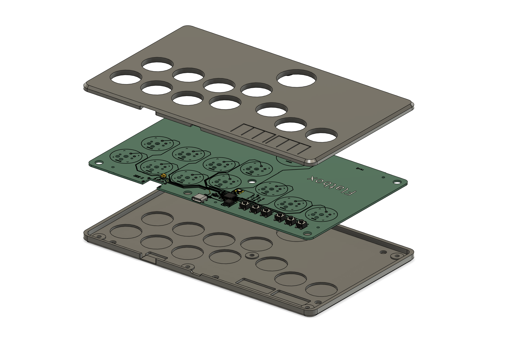

# Flatbox rev8

This is rev8 of the Flatbox. In this version the PCB includes the microcontroller - everything is built in, you only have to add the switches (and flash the firmware). It has a USB Type A host port that you can use to plug in authentication dongles or other devices if the firmware you use supports that.

There are two variants of the case, version A uses flaps for the option buttons, version B has holes so that you can use buttoncaps on the tact switches:

To make one you will need:

* [3D printed case parts](3d-printed-case) - top and bottom
* [the PCB](pcb)
* 12x Kailh low profile (choc v1) switches of your choice
* (optionally) 12x Kailh low profile hotswap sockets
* buttoncaps for the action buttons, either [3D printed](../3d-printed-buttoncaps) or (preferably) injection molded (make sure they're the correct size: 22.5mm and 28.5mm)
* for case variant A:
  * 6x 6x6x5mm tact switches
* for case variant B:
  * 6x 6x6x7mm tact switches
  * 6x silicone buttoncaps (like [these](https://www.aliexpress.com/item/32846395636.html) or search for "silicone button caps" on AliExpress; or you can use other caps as long as they fit, the hole diameter is 7.5mm)
* 7x M3x6 flat head (countersunk) screws
* 5x M2x4 screws to secure the PCB to the case
* some kind of rubber feet or non-slip padding for the bottom
* a soldering iron

I printed the case at 0.20mm layer height. The top part should be printed upside-down, the bottom part should be printed as-is. They don't require supports.

I used [JLCPCB](https://jlcpcb.com/) to make the PCB and assemble the SMD parts. The [included files](pcb) can be used with JLCPCB directly. If you want to use some other service, check the file formats that they expect. When ordering from JLCPCB, upload the Gerber zip, leave all the settings at default (you can choose the PCB color), then enable "PCB Assembly" and upload the BOM and CPL files in the next step. PCB thickness should be 1.6mm.

The PCB you get from JLCPCB will look something like this:

The switches can be soldered in directly to the PCB or you can use hotswap sockets.

You can use any firmware compatible with the RP2350 chip. Here's how to use it with the HID Remapper firmware.

First, download the [remapper_flatbox_rev8.uf2](https://github.com/jfedor2/hid-remapper/releases/latest/download/remapper_flatbox_rev8.uf2) firmware file from the latest release.

To flash the firmware, connect the PCB to a computer with a USB cable, then press the RESET button while holding the BOOT button on the PCB. A drive named "RP2350" should appear. Copy the UF2 file you downloaded to that drive. That's it.

Then go to the [HID Remapper configuration website](https://www.remapper.org/config/), in the Examples tab find the "Flatbox rev4/rev8" configuration and click on that. Then click "Open device" and connect to your device. Then click "Save to device" to save the configuration to your Flatbox. This configuration acts as a Switch gamepad, which should also work on PC. If you want to play on PS5, change the emulated device type to "PS4 arcade stick".

For more information on how to use the HID Remapper firmware, see the project's [website](https://www.remapper.org/).

If you want to modify the case or the PCB, check out the files in the [extras](extras) folder.

PCB design licensed under [CC BY-SA 4.0](https://creativecommons.org/licenses/by-sa/4.0/).

PCB design uses the following libraries:

* [keyswitches.pretty](https://github.com/daprice/keyswitches.pretty) by [daprice](https://github.com/daprice) ([CC BY-SA 4.0](https://creativecommons.org/licenses/by-sa/4.0/))
* [Type-C.pretty](https://github.com/ai03-2725/Type-C.pretty) by [ai03-2725](https://github.com/ai03-2725)
* Symbols and footprints from the [minimal design example](https://datasheets.raspberrypi.com/rp2350/Minimal-KiCAD.zip) from the [Hardware design with RP2350](https://datasheets.raspberrypi.com/rp2350/hardware-design-with-rp2350.pdf) document
